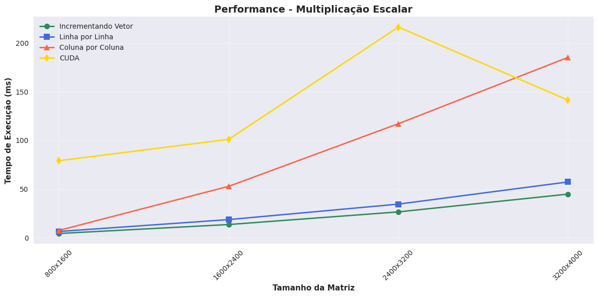
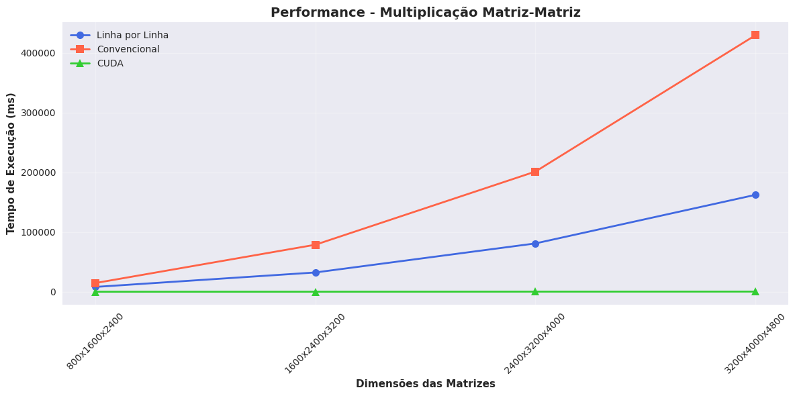

# Relatório de Performance - Operações de Matriz em CUDA
- Tomás Lenzi (2220711)
- Bruno Wolf (2212576)

## Análise do Código matrix_lib.cu

### Funcionalidades Implementadas

O arquivo `matrix_lib.cu` implementa duas operações matriciais principais utilizando CUDA:

#### 1. Multiplicação Escalar (`scalar_matrix_mult`)
- **Kernel CUDA**: `scalar_matrix_mult_kernel` 
- **Funcionamento**: Cada thread processa um elemento da matriz, multiplicando-o pelo escalar
- **Paralelização**: 1D - uma thread por elemento da matriz
- **Configuração**: Blocks e threads configurados dinamicamente baseado no tamanho total da matriz

#### 2. Multiplicação Matriz-Matriz (`matrix_matrix_mult`)
- **Kernel CUDA**: `matrix_matrix_mult_kernel`
- **Funcionamento**: Cada thread calcula um elemento da matriz resultado C[i,j] = $\Sigma$(A[i,k] * B[k,j])
- **Paralelização**: 2D - grade bidimensional onde cada thread corresponde a uma posição (linha, coluna) na matriz resultado
- **Configuração**: Grid 2D com dimensões calculadas baseadas nas dimensões das matrizes

### Gerenciamento de Memória
Ambas as funções implementam:
- Alocação de memória no device (`cudaMalloc`)
- Transferência host→device (`cudaMemcpy`)
- Execução do kernel com sincronização (`cudaDeviceSynchronize`)
- Transferência device→host dos resultados
- Liberação adequada da memória do device (`cudaFree`)

### Tratamento de Erros
- Verificação de ponteiros nulos
- Validação de dimensões das matrizes
- Tratamento de erros CUDA com cleanup de memória em caso de falha

## Análise dos Resultados de Performance

### Multiplicação Escalar

**Melhores Implementações:**
1. **Incrementando Vetor**: Consistentemente a mais rápida das implementações CPU (4.4ms → 44.85ms)
2. **Linha por Linha**: Segunda melhor opção CPU (6.454ms → 57.355ms)
3. **Coluna por Coluna**: Mostra degradação significativa com o aumento do tamanho (7.538ms → 185.302ms)

**CUDA Performance:**
- Tempo relativamente constante (~79-216ms), mas **não competitiva** com as implementações CPU
- Overhead de transferência de memória e setup pode estar dominando o tempo total
- Para matrizes pequenas/médias, o custo de setup CUDA supera os benefícios de paralelização

### Multiplicação Matriz-Matriz

**Resultados Dramáticos:**
- **CUDA**: Extremamente superior (18.26ms → 239.317ms)
- **Linha por Linha**: Implementação CPU mais eficiente (8,046ms → 162,208ms)  
- **Convencional**: Menos eficiente (14,547ms → 429,485ms)

**Speedup CUDA:**
- 800x1600x2400: **440x** mais rápido que linha por linha, **796x** mais rápido que convencional
- 3200x4000x4800: **677x** mais rápido que linha por linha, **1,794x** mais rápido que convencional

### Conclusões

1. **Para multiplicação escalar**: Implementações CPU são superiores devido ao baixo overhead
2. **Para multiplicação matriz-matriz**: CUDA mostra vantagem massiva, especialmente em matrizes grandes
3. **Ponto de break-even**: CUDA torna-se vantajosa quando a computação supera significativamente o overhead de transferência de dados
